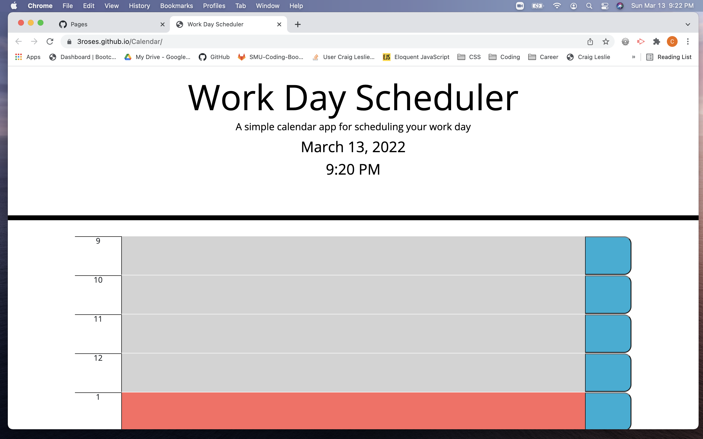

# Calendar

I created a calendar in my javaScript file that is appended to the DOM when the page loads.  This calendar makes use of bootstrap classes for columns and rows.

The calendar has a button for each hour. If there is anything in the text area when the user pushes that button, the information is saved to local storage. Local storage updates the global variable when the webpage loads so that the data persists.

Each text area is color-coded according to what time of day it is. Textareas for hours that have passed will be grey, the current text area will be red, and the future text areas will be green.

## Screenshot

## Link to Page

[Link to the final page](https://3roses.github.io/Calendar/)